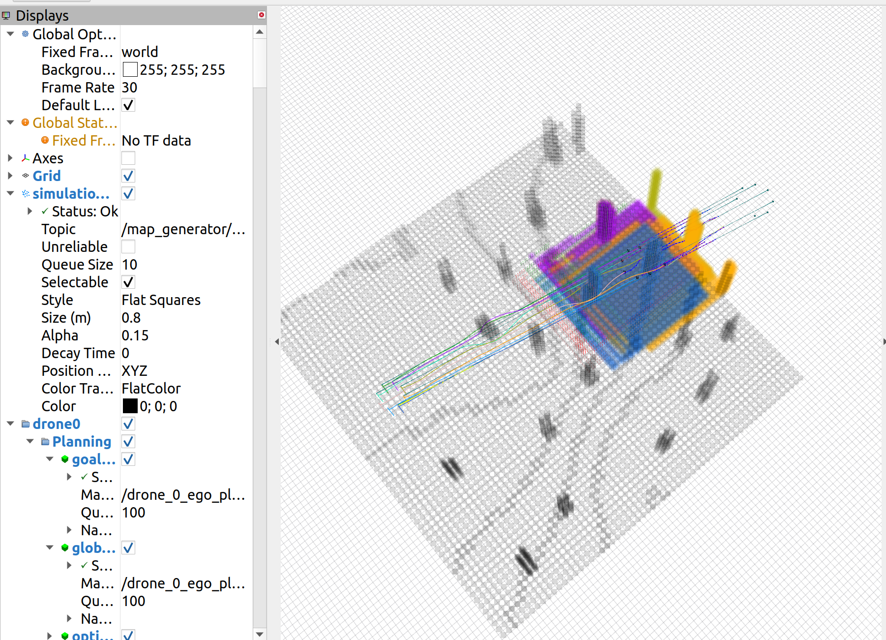

# Swarm-Formation-Airsim

*The program is experimentally developed, test on Ubuntu 20.04.*




## 1. About

[**Swarm-Formation**](https://github.com/ZJU-FAST-Lab/Swarm-Formation) is a distributed swarm trajectory optimization
framework for formation flight in dense environments.

[**Airsim**](https://github.com/microsoft/AirSim) is a simulator for drones, cars and more, built on Unreal Engine.

## 2. Start

1. Install ROS on your machine.

2. Compile UE 4.27 (Mandatory) and Airsim Plugin on Linux, and prepare an airsim project
   following [link](https://microsoft.github.io/AirSim/unreal_custenv/).

3. Compile the project:

```
cd Swarm-Formation-Airsim
catkin_make -j1
```

4. Run Airsim simulator:

```
source devel/setup.bash
ue_config=$(rospack find airsim_package)/ue_settings/fly.json
"<path>/Binaries/Linux/<executable name>" -settings= ${ue_config}
```

5. Execute the program:

```
source devel/setup.bash
roslaunch ego_planner fly.launch
```

#### After Running

Check the directory `bags/` where it should contain rosbags and videos inside different directories.

## 3. Structure

#### *The program is experimentally developed and  contains a lot of unused code and unnecessary components.*


Considering the files in `src/airsim/scripts/`:

- `bridge.py` act as a controller that **reset** the simulator and IPC with other programs. It also publish the global
  map for visualization in rviz.

- `bridge_*.py` provide odometry and lidar information from Airsim and receive velocity and send to Airsim.

- `navigation_control.py` is a upper-level controller which controls navigation points of the swarm.

- `*_record.py` records rosbag file from ROS and videos from Airsim.

More details and program executed can be observed in `src/planner/plan_manage/launch/fly.launch`

## 4. Changes to origianl [Swarm-Formation](https://github.com/ZJU-FAST-Lab/Swarm-Formation)

Please review the ***git commits*** and use AI tools to assist with understanding them.

## 5. Tips

Strongly recommend **[rosmon](http://wiki.ros.org/rosmon)** to replace  **roslaunch**.